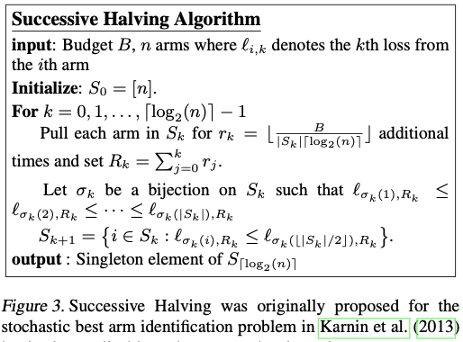
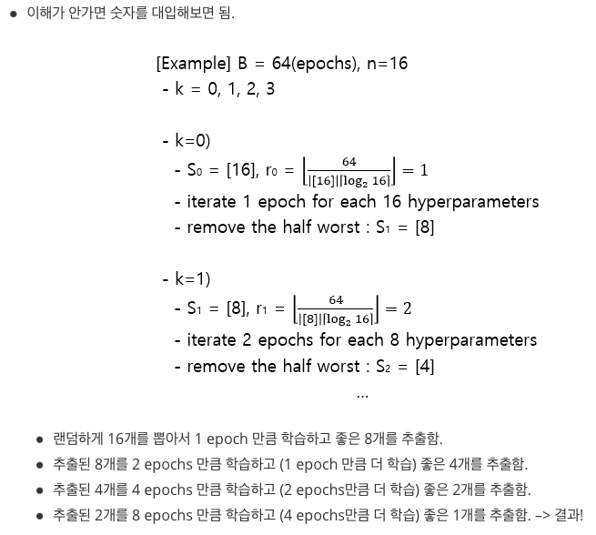
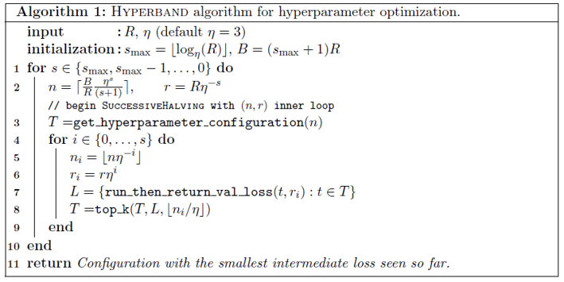
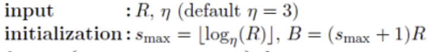
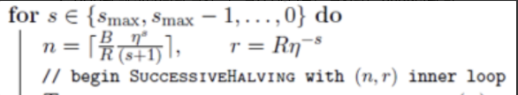
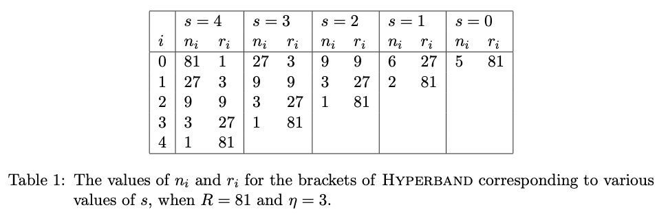
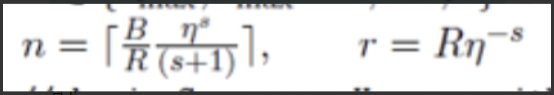

# 하이퍼밴드(Hyperband), Successive Halving Algorithm(SHA)의 흐름 이해하기

가끔 요약을 미리 보면 이해하기 수월할 때가 있다...

### **요약**

**SHA**는 B/n번 탐색 B*(2^0) -> b/2(1)*(2^1)  -> ... -> b/2(n-1)*(2^(n-1)) -> 1*(2^n)

ex)

B =32 n=8 일 경우

32개중 랜덤하게 8개를 뽑아 1번 학습 후 4개 추출 -> 추출된 4개 2번 학습 후 2개 추출-> 추출된 2개 4번 학습 후 1개 추출 -> 1개 8번 학습 -> 결과!!!!

**HYPERBAND**는 SHA의 B와 n을 일정 비율로 정해주면서 SHA를 이용해 탐색한다.

---

하이퍼 밴드 알고리즘은 keras tuner 프레임 워크에서 사용되는 알고리즘 중 하나이다.

keras tuner는 모델을 쉽게 튜닝해주는 프레임 워크이다.

모델 튜닝이란 모델을 구성하는 여러 요소 중 최적의 요소 값(하이퍼 파라미터)을 찾아내는 과정이다. 또한, 하이퍼 파라미터 튜닝이라고도 부른다. 이때 keras tuner 프레임 워크는 최적의 하이퍼 파라미터의 구성을 찾아준다.

하이퍼 밴드는 Successive Halving Algorithm을 보완한 알고리즘이다. 하이퍼 밴드를 이해하기 위해서 Successive Halving Algorithm의 작동 흐름을 이해하고 넘어가야 한다.

### **Successive Halving Algorithm(SHA)**

제한된 시간에서 최소의 loss를 갖는 모델의 하이퍼 파라미터 구성을 찾는 것이 목표이다.

이름처럼 연속 분할 알고리즘이다.(Successive Halving Algorithm)

1. 총탐색에 소요되는 budget 설정. (B) (*budget(epoch, data 등 학습에 투입되는 자원))
2. n개의 하이퍼 파라미터 설정을 랜덤 하게 뽑는다. (Sk)
3. S0의 모델들에 동일한 budget을 할당. (rk)
4. 학습 및 중간 loss 추출.
5. 중간 loss를 기준으로, 성능이 좋지 않은 하이퍼 파라미터 설정을 반만큼 버림. (Sk+1)
6. 하나의 하이퍼 파라미터 설정이 남을 때까지 2, 3, 4, 5를 반복.

- Successive Halving Algorithm(SHA)의 단점
    - 알고리즘 자체의 hyperparameter(input) : B와 n (정확히는 B/n)에 따라서 **exploration과 exploitation의 비율**이 정해진다.
    - 따라서 알고리즘 성능을 위해 B와 n이라는 hyperparameter 설정이 굉장히 중요해진다.

### **Hyperband**

Successive Halving Algorithm(SHA)의 단점에서 언급된 B와 n의 단점을 보완한 알고리즘 (B와 n을 정해준다)

1. 하나의 하이퍼 파라미터 설정에 최대로 할당할 budget 설정 (R) (*budget(epoch, data 등 학습에 투입되는 자원))

2. SHA의 매 step마다 줄어드는 설정 개수(혹은 늘어나는 budget의 비율) 설정. (etha = ŋ ) (SHA에서는 2)

3. R과 etha에 따라서 SHA를 반복할 개수 (etha(ŋ) defailt = 3) (1 SHA = 1 bracket으로) 및 각 SHA의 처음 step에서 초기화하는 설정의 개수와 할당되는 budget이 계산됨 **(위의 공식에서 Smax가 bracket)**

4. R을 통해서 SHA에 들어갈 B,n 을 위의 공식을 통해 n,r 로 정해줌

5. 각 bracket의 SHA 모두 실행

s는 bracket, i는 (0~s), budget 은 81, etha(ŋ)은 3으로 설정 후 Hyperband를 실행하면 아래 그림과 같다.

s가 감소되면 탐색할 범위는 줄어들고 epochs 은 커진다. (반비례)

전체를 한번 또는 두 번 정도 탐색하고 그 후 일정 비율로 loss값이 낮은 하이퍼 파라미터를 버린다.

남은 하이퍼 파라미터 값을 탐색하는데 탐색하는 epochs값은 커진다.

ex) 모델 81개를 1번씩 탐색 후 ... 모델 1개를 81번 탐색한다.

**특징**

- B와 n을 설정하지 않고 R하나만 설정하는 것으로도 다양한 exploration, exploitation 비율을 반영한 검색을 진행할 수 있다.
    - R은 한 하이퍼 파라미터 설정에 할당되는 최대 Budget 이기 때문에 학습하고 싶은 만큼 값을 설정하면 된다.
    - R을 한 단위로 볼 수 있다.
- 각 bracket들은 평행하게 수행할 수 있다
    - 전체 탐색 시간 단축 가능
- Budget은 학습에 사용되는 자원으로, 제한될 수 있는 다양한 것들이 budget이 될 수 있음.
    - 학습 iterations(학습 시간), 학습 dataset 개수, 학습 데이터의 feature, 등…
- etha는 다양한 값이 될 수 있으나, 저자들은 3 또는 4에서 좋은 결과를 얻었다고 말한다.

### 

### **한번 더 요약**

**SHA**는 B/n번 탐색 B*(2^0) -> b/2(1)*(2^1)  -> ... -> b/2(n-1)*(2^(n-1)) -> 1*(2^n)

ex)

B =32 n=8 일 경우

32개중 랜덤하게 8개를 뽑아 1번 학습 후 4개 추출 -> 추출된 4개 2번 학습 후 2개 추출-> 추출된 2개 4번 학습 후 1개 추출 -> 1개 8번 학습 -> 결과!!!!

**HYPERBAND**는 아래 공식을 통해 n과 r을 구해 SHA에 들어갈 B와n을 구한다. SHA의 B와 n을 일정 비율로 정해주면서 SHA를 이용해 SHA를 연속한다.

 [KerasTuner코드](./KerasTuner.md) 

참고

HYPERBAND 논문 정리(한글) - [https://pod3275.github.io/paper/2019/05/23/Hyperband.html](https://pod3275.github.io/paper/2019/05/23/Hyperband.html)

SHA논문(영어) - [https://arxiv.org/pdf/1502.07943.pdf](https://arxiv.org/pdf/1502.07943.pdf)

HYPERBAND논문(영어) - [https://arxiv.org/pdf/1603.06560.pdf](https://arxiv.org/pdf/1603.06560.pdf)

