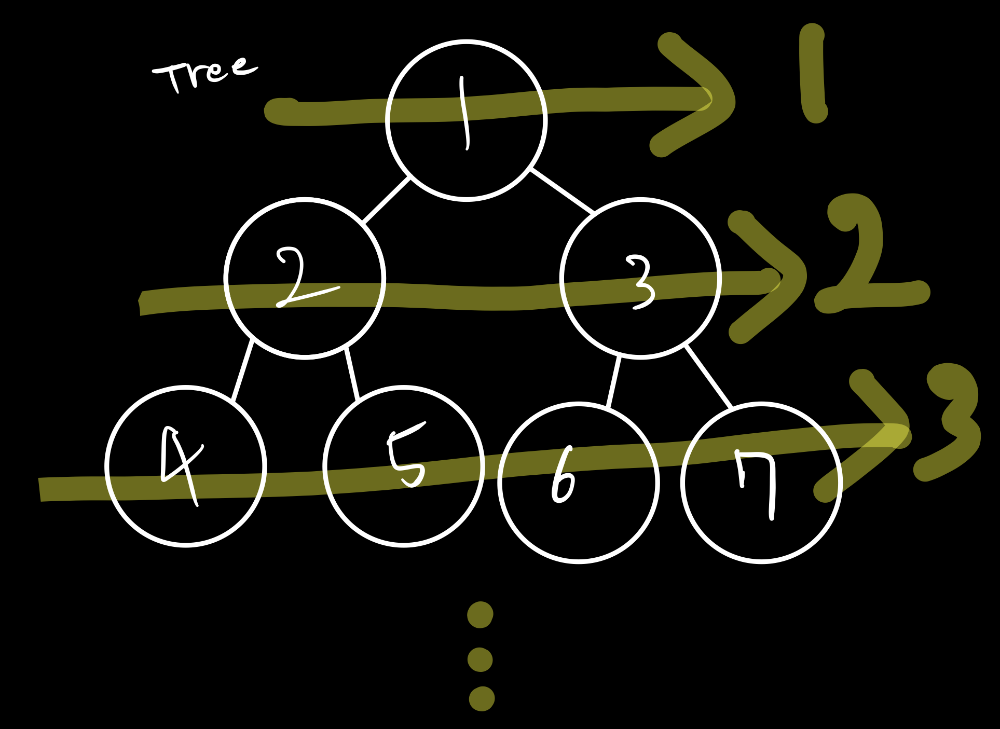
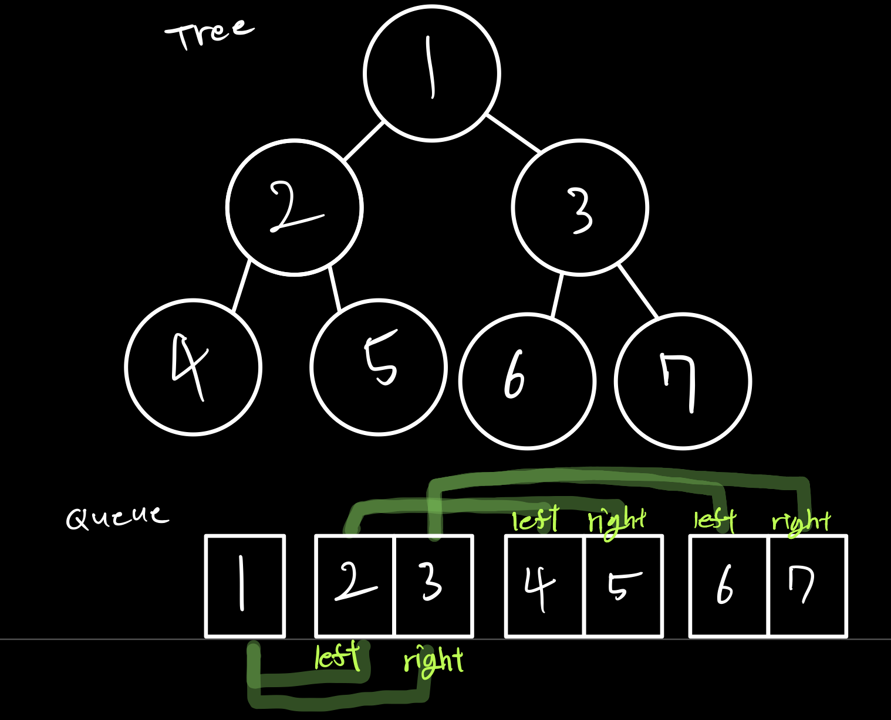
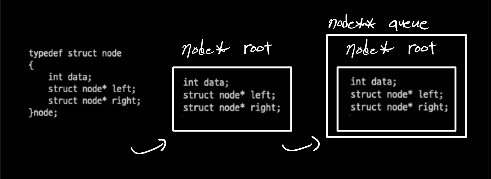

이진 트리 레벨 순회 (LevelTraverse)
===

### 이진트리 레벨 순회란.

트리를 레벨이 낮은 순으로 순회하는 검색 방식 중 하나이다.



같은 레벨에 있다면 왼쪽부터 오른쪽으로 나열된다. (ex. 1, 2, 3, 4, 5, 6, 7)

레벨 순회를 하기 위해서는 트리를 큐 자료구조에 넣어주면 된다.



이런 식으로 첫 root를 넣으면 그 root의 왼쪽 자식과 오른쪽 자식 순으로 넣어준다.

Queue는 FIFO 방식으로 먼저 넣은 값이 우선으로 나오기 때문에 부모-자식 순으로 자식-자식의 자식 순으로 레벨 순회를 하게 된다.

사실 이진 탐색 트리(BST) 포스팅에서 다룬 트리와 Queue 포스팅에서 다룬 내용을 합치면 

루트 노드를 넣으면 그 노드의 자식 노드를 넣고 그 노드의 자식을 넣는 하는 방식이다.

트리 노드를 큐에 넣어야 하는데 큐를 선언할 때 '트리노드\* 큐'로 선언해주면 된다.

이진트리 레벨 순회는 [이진 검색 트리](https://iyk2h.tistory.com/136)와 [큐](https://iyk2h.tistory.com/137)를 합치면 쉽게 풀어갈 수 있다. (이론만...)

### 핵심 부분

---

``` c
node** queue;; //반환형 node* 을 담기 위한 queue

void insertQ(node** queue, int *front, int *rear, node* new_n)
{
	queue[*rear] = new_n;
	(*rear)++;
}

node* deQ(node** queue, int *front)
{
	(*front)++;
	return queue[*front -1];
}

void printLevelOrder(node* root)
{
	int front = 0, rear = 0;
	node** queue = (node**)malloc(sizeof(node*)*Q_size);
	
    node* temp_node = root;

	while (temp_node)
	{
		printf("%d ", temp_node->data);

		if (temp_node->left)
			insertQ(queue, &front, &rear, temp_node->left);
		if (temp_node->right)
			insertQ(queue, &front, &rear, temp_node->right);
		temp_node = deQ(queue, &front);
	}
}
```



큐를 선언할 때 이중 포인터를 사용한 이유는 아래의 그림과 같이 큐 노드의 반환형은 node\* 이기 때문이다.

그리고 insertQ 함수에서 보면 queue\[\*rear\] 을 보면 알다시피 queue 배열에 node\* rootd를 담는 구조이다.

###  코드

---

``` c
#include<stdio.h>
#include<stdlib.h>

#define Q_size 128

typedef struct node
{
    int data;
    struct node* left;
    struct node* right;
}node;

node* root;

node* insert(node* Nnode, int value)
{
	if(Nnode == NULL)
	{
		Nnode = (node*)malloc(sizeof(node));
		Nnode->data=value;
		Nnode->left = Nnode->right = NULL;
		return Nnode;
	}
	else
	{
		if(value < Nnode->data)
			Nnode->left = insert(Nnode->left, value);
		else
			Nnode->right = insert(Nnode->right, value);
	}
	return Nnode;
}

node* fMin(node* root)
{
    node* min = root;
    while(min->left!=NULL)
        min = min->left;
    return min;
}

node* delete(node* root,int data)
{
    node *tmproot = NULL;

    if(root==NULL)
        return NULL;
    if(data < root->data)
        root->left = delete(root->left,data);
    else if(data > root->data)
        root->right = delete(root->right,data);
    else
    {
        if(root -> left!=NULL && root->right != NULL)
        {
            tmproot = fMin(root->right);
            root->data = tmproot->data;
            root->right = delete(root->right,tmproot->data);
        }
        else
        {
            tmproot = (root->left == NULL) ? root->right : root->left;
            free(root);
            return tmproot;
        }
    }
    return root;
}

node** queue;;

node** createQ(int *front, int *rear)
{
	node** queue = (node**)malloc(sizeof(node*)*Q_size);
	*front = *rear = 0;
	return queue;
}

void insertQ(node** queue, int *front, int *rear, node* new_n)
{
	queue[*rear] = new_n;
	(*rear)++;
}
node* deQ(node** queue, int *front)
{
	(*front)++;
	return queue[*front -1];
}

void printLevelOrder(node* root)
{
	int front, rear;
	node** queue = createQ(&front, &rear);
	node* temp_node = root;

	while (temp_node)
	{
		printf("%d ", temp_node->data);

		if (temp_node->left)
			insertQ(queue, &front, &rear, temp_node->left);
		if (temp_node->right)
			insertQ(queue, &front, &rear, temp_node->right);
		temp_node = deQ(queue, &front);
	}
}

int main()
{
	root = insert(root, 1);
	root = insert(root, 2);
	root = insert(root, 3);
	root = insert(root, 4);
	root = insert(root, 5);
	root = insert(root, 6);
	root = insert(root, 7);
	root = insert(root, 8);
	
	printLevelOrder(root);
}
```