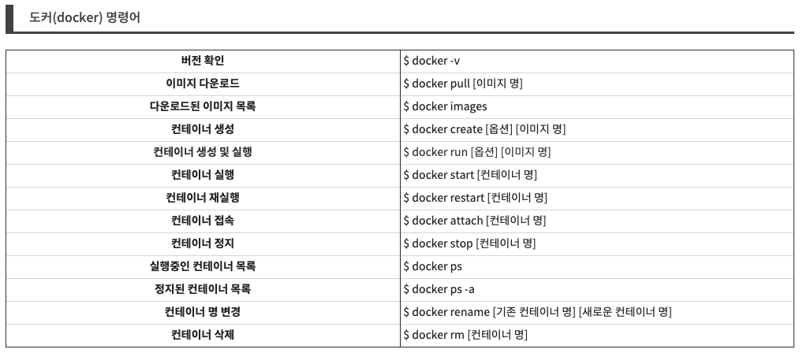

# Server

---

## All about the Mac mini server

[Mac mini Server](http://www.macminiserver.com/)

## 다용도NAS

[구형 맥미니 활용 - 다용도 NAS! 2/2화](http://blog.naver.com/PostView.nhn?blogId=starfall909&logNo=221041300820&parentCategoryNo=&categoryNo=&viewDate=&isShowPopularPosts=false&from=postView)

## 맥 서버로 만들기

[웹서버 운영하기 : 맥 - 생활코딩](https://opentutorials.org/course/3084/18894)

[맥북에 웹 서버 설치하기](https://ejko0911.medium.com/%EB%A7%A5%EB%B6%81%EC%97%90-%EC%9B%B9-%EC%84%9C%EB%B2%84-%EC%84%A4%EC%B9%98%ED%95%98%EA%B8%B0-e2903f80d919)

## 맥 외부망에서 원격 제어하는 방법

[[맥 / macOS] 원격 접속하는 방법 | 내부망 / 외부망 - Mac In June](https://macinjune.com/all-posts/mac/tip/%EB%A7%A5-macos-%EC%9B%90%EA%B2%A9-%EC%A0%91%EC%86%8D%ED%95%98%EA%B8%B0/)

[ipTIME 공유기 원격접속 포트포워딩 설정하는 방법 - 익스트림 매뉴얼](https://extrememanual.net/6684)

[외부 ip에서 local 서버 접속](https://10000sukk.tistory.com/23)

[맥북 터미널 외부에서 접속하고 싶은데,,, 잘 되지 않습니다. : 클리앙](https://www.clien.net/service/board/cm_mac/14644641)

[맥북 로컬 호스트 외부 접속하기](https://velog.io/@agugu95/%EB%A7%A5%EB%B6%81-%EB%A1%9C%EC%BB%AC%ED%98%B8%EC%8A%A4%ED%8A%B8-%EC%A0%91%EC%86%8D%ED%95%98%EA%B8%B0)

[http://blog.rainheart.net](http://blog.rainheart.net/wordpress/?p=61)

[윈도우10에서 Mac 원격 접속 방법 - 익스트림 매뉴얼](https://extrememanual.net/34141)

[프로그램 설치 없이 맥 원격 제어 하기 (windows, mac) | YeopBox](https://yeopbox.com/%ED%94%84%EB%A1%9C%EA%B7%B8%EB%9E%A8-%EC%84%A4%EC%B9%98-%EC%97%86%EC%9D%B4-%EB%A7%A5-%EC%9B%90%EA%B2%A9-%EC%A0%9C%EC%96%B4-%ED%95%98%EA%B8%B0-windows-mac/)

## 맥 ssh 접속, ssh 설정

[macOS SSH 서버(sshd)를 사용하여 원격에서 터미널 접속하기 - JooTC](https://jootc.com/p/201810122013)

[[홈서버] 홈서버 구축#2 - 원격 접속 환경 설정](https://november11tech.tistory.com/91)

[원격 컴퓨터가 Mac에 접근하도록 허용하기](https://support.apple.com/ko-kr/guide/mac-help/mchlp1066/mac)

## 도커

[macOS 도커(Docker) 설치 방법 및 명령어](https://whitepaek.tistory.com/38)

### 도커 명령어

### 도커 사용 가이드

[도커(Docker) 입문편: 컨테이너 기초부터 서버 배포까지](https://www.44bits.io/ko/post/easy-deploy-with-docker)

## 윈도우 원격 접속

[[MAC] 맥에서 윈도우 원격접속 Microsoft Remote Desktop 설정 및 사용법](https://haddoddo.tistory.com/entry/MAC-%EB%A7%A5%EC%97%90%EC%84%9C-%EC%9C%88%EB%8F%84%EC%9A%B0-%EC%9B%90%EA%B2%A9%EC%A0%91%EC%86%8D-Microsoft-Remote-Desktop-%EC%84%A4%EC%A0%95-%EB%B0%8F-%EC%82%AC%EC%9A%A9%EB%B2%95)

