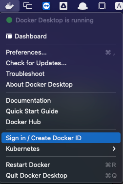
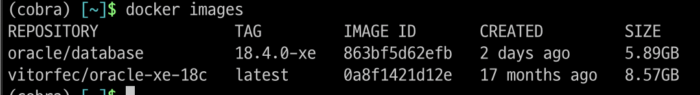
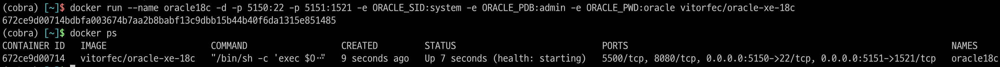
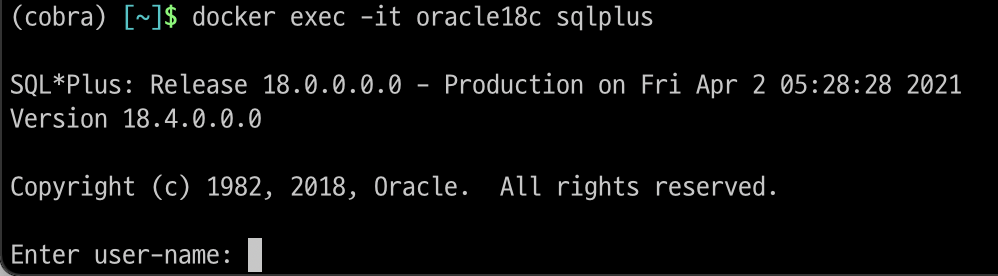
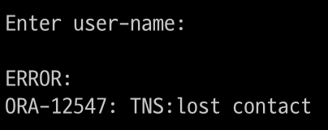

글을 작성하기 앞서 일단 필자는 user-name과 Password 부분에서 ORA-12547라는 오류가 생겨 접속을 하지 못했다.

이 오류를 해결하신 분은 저에게도 도움을 주시면 감사하겠습니다!


Oracle DB를 사용해야 하는 수업이 있어 사용 중인 맥북에 설치를 해야 하는 일이 생겼다.

사실 그냥 다운로드하고 사용하는 중이었다면 이렇게 글을 남기진 않았을 거 같다..


일단 설치하는 방법은..


일단 맥에 도커를 다운로드합니다.

오라클이 맥을 지원하지 않기 때문에 도커를 이용해 컨테이너를 생성하고 그 안에 오라클 DB를 설치해야 합니다.

회원가입 후 설치하도록 하자

[Docker Desktop for Mac - Docker Hub](https://hub.docker.com/editions/community/docker-ce-desktop-mac)

설치된 도커를 실행하면 메뉴바에 도커가 생긴다.



오른쪽 상단 메뉴바에 있는 도커에 로그인을 합니다.


터미널을 실행 후 


도커 이미지를 다운로드하기 위해 아래와 같이 코드를 입력한다.

```
docker pull vitorfec/oracle-xe-18c
```

이미지가 잘 다운로드하여졌는지 확인하기 위해

```
docker images
```



다운로드한 이미지를 컨테이너를 생성 후 실행하기 위해 코드를 입력한다.

```
docker run --name oracle18c -d -p 5150:22 -p 5151:1521 -e ORACLE_PWD:1234 vitorfec/oracle-xe-18c
```

코드에 대한 부가 설명

다운로드한 이미지를 컨테이너로 생성 뒤 실행 이때 이름은 oracle18 c 포트번호는 5151로 만듦

Pwd-1234 지정


컨테이너 확인 

```
docker ps
```



확인 후


오라클 sqlplus에 접속

```
docker exec -it oracle18c sqlplus
```




위에서 비밀번호를 설정하지 않았다면, 초기 user-name 은 system, Password 는 oracle로 초기 설정되어있다.


하지만 난 여기서 막혔다.. id, pwd가 분명 system과 1234 이여야 하는데.. 

그래서 일단 임시방편으로 윈도우 컴퓨터를 원격으로 접속해 사용 중이다..



ORA-12547 에 대한 오류를 찾아보는 중인데 생각보다 많은 사용자가 이런 오류를 가지고 있다. 일단 오류를 잡으면 추후에 추가로 포스팅해야겠다.

여분은 모두 정상 접속되길! 기원합니다.


정상적으로 로그인이 되었다면 성공이다. 이제 Oracle SQL Develope 을 이용해서 DB 공부를 하면 된다.

다음 포스팅은 오류 많은 Oracle SQL Develope 을 설치하고 연결하는 부분까지이다.

그다음은 윈도우에 설치한 Oacle DB_Server 에 접속하는 방법과 윈도우에서 외부 접속을 허용하는 방법을 알아보자.


실패하고 느낀 점

그래도 도커의 개념과 흐름을 이해해서 나쁘지 않은 실패인듯했다. 그렇지만 왜 꼬였는지는 모르겠다.

그리고 오라클을 너무 헤비한? 최적화가 좀 덜된 느낌이 강했다. 그리고 서버는 macOS, windowOS 보다는 Linux, Ubuntu 를 이용하는 게 훠얼신 좋은 거 같다. 그래도 컴퓨터가 어떤 식으로 네트워킹되는지 알 수 있어서 좋았다.