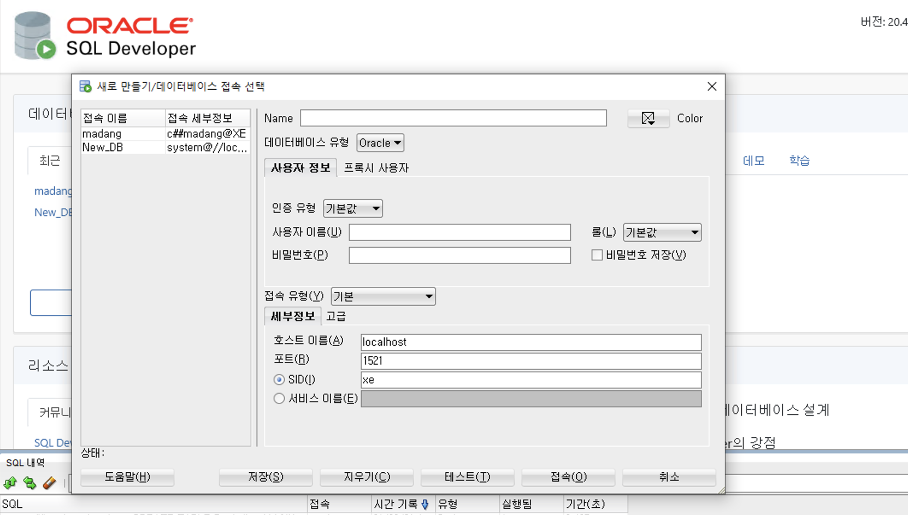
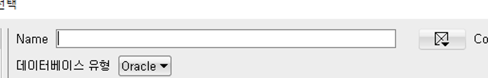
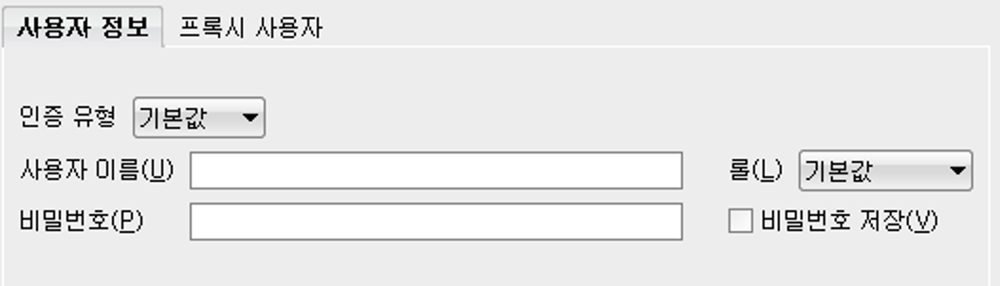
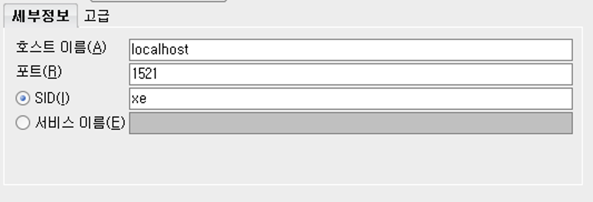
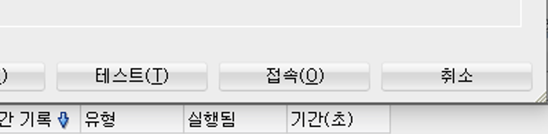
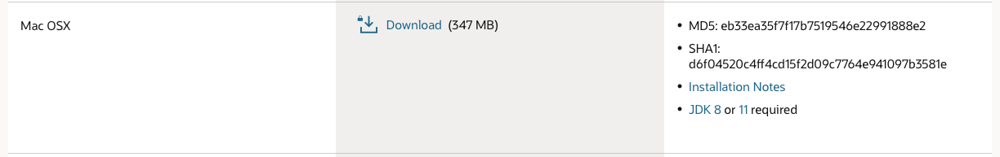
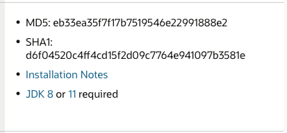
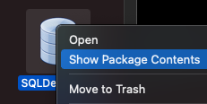
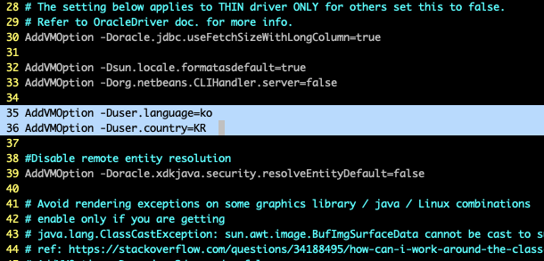

아래 링크에서 Oracle SQL Developer 을 다운로드한다.

[sqldev-downloads](https://www.oracle.com/tools/downloads/sqldev-downloads.html)

다운로드하고 정상적으로 작동이 된다면 연결하면 된다. 혹시 정상적으로 작동이 되지 않는다면 아래에 내가 겪은 문제와 해결방법을 적어두었다.


이런 화면이 보이면 좌측 상단에 초록색으로 + 모양이 있을 것이다.

새 접속이라는 것인데 전 포스팅에서 설치한 DB서버를 연결해주는 작업이다.



버튼을 정상적으로 눌렀다면 이런 식으로 새로 만들기/데이터베이스 접속 선택 이 있을 것이다.



Name은 자신이 원하는 값을 입력하고




사용자 이름과 비밀번호는 전 포스팅에서 설정했다면 그대로 사용자 이름과 비밀번호를 입력하면 된다. 혹은 설정을 따로 하지 않았다면 사용자 이름은 system, 비밀번호는 oracle로 초기 설정돼있을 것이다.




그리고 세부 정보에  호스트 이름은 따로 다른 컴퓨터의 서버를 사용하지 않는다면 그래도 사용하고 다른 컴퓨터를 사용한다면 그 컴퓨터의 IP주소를 적으면 된다.

포트도 전에 DB서버를 설치할 때 설정하지 않았다면 1521을 사용하면 되고 설정을 했다면 설정한 번호 그대로 사용하면 된다. (ex. 전 포스팅 기준 내 포트번호는 5151이다.



접속을 눌러 연결하자! 그럼 끝! 생각보다 쉽게 연결된다. 이제 DB공부를 열심히 하면 된다.!


자 이제 내가 설치하면서 자잘하게 오류 났던 부분들과 전 포스팅에서 DB서버 컨테이너의 설치를 실패해서 대안에 대해서 작성해볼까 한다. 


일단. 사용자 이름과 비밀번호에서 오류가 나는 건 아직 잡지 못했다. 그래서 그냥 윈도우 컴퓨터에 깔려있는 DB서버를 접속하기로 했다. 윈도우에서 포트만 열어주면 쉽게? 접속이 가능하니까!


그래서 일단 오라클 DB Developer 를 설치하자.

아래 링크에서 Oracle SQL Developer 을 다운로드한다. macOS 용으로!

[sqldev-downloads](https://www.oracle.com/tools/downloads/sqldev-downloads.html)



다운로드하기 전에 오른쪽 부분에 JDK 가 있으므로 JDK를 먼저 다운로드하고 Developer 을 다운로드하자




둘 다 정상적으로 다운을 받았을 때 난 오류가 났다. 

실행조차 안 되는 오류다.! 멘붕....

구글링을 좀 해보니 JDK의 버전을 설정해줘야 한다.


터미널을 켜서

```
$ vim ~/.sqldeveloper/20.4.1/product.conf //$은 쉘을 의미 vim~ 입렵해주세요
```


들어가 보면 20줄쯤 SetJavahome 이라고 있다.

거기 부분을 혹은 그 바로 아래줄에

```
SetJavaHome /Library/Java/JavaVirtualMachines/jdk1.8.0_281.jdk/Contents/Home
```

적어주자.

*혹시 몰라서 vim 은 텍스트 에디터로 i를 입력해 수정 모드로 들어가 esc를 누르고 명령어 모드에서 :wq을 누르면 저장 후 나와진다!*

자 그리고 다시 SQL Developer 를 작동하면 정상 작동이 된다.!


혹시 **local not recognized 라고 오류가 난다면...**

프로그램 아이콘 위에서 우클릭 후 패키지 내용 보기를 누른다



들어간 후

Contents > Resources > sqldeveloper > sqldeveloper > bin > sqldeveloper.conf 파일을 vim 혹은 텍스트 편집기를 열어준다.

터미널이면 다운로드 폴더에 있으면

```
cd /Downloads/SQLDeveloper.app/Contents/Resources/sqldeveloper/sqldeveloper/bin
```

어플리케이션 폴더에 있으면

```
cd /Applications/SQLDeveloper.app/Contents/Resources/sqldeveloper/sqldeveloper/bin
```

들어가서

```
vim sqldeveloper.conf
```

후

```
AddVMOption -Duser.language=ko
AddVMOption -Duser.country=KR
```



입력해준다!


그 후 재시작하면 될 것이다.!! 모두 열공!


다음 포스팅은 윈도우 환경일때 Oracle DB 서버에 외부에서 접속이 가능하도록 설정하는 방법을 적어볼까 한다.
